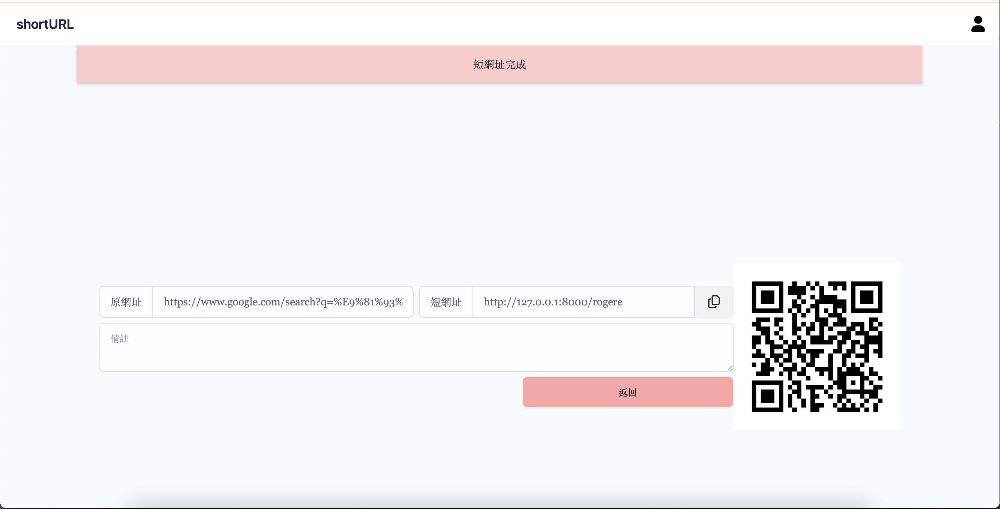
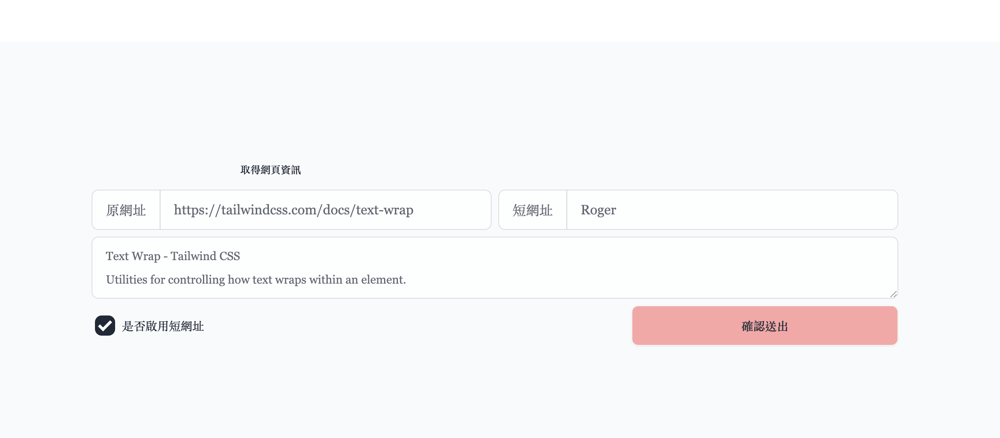

# ShortURL

- 縮短您的網址
- 可以取得網頁簡單資訊，例如：標題、描述
- 勾選是否啟用該短網址，未啟用則無法使用短網址
- 產生短網址 QRcode
- 或點擊 icon，將複製到剪貼簿

    
    

## 使用技術

- 前端：

  - Alpine.js
  - django-tailwind

- 後端：

  - Python、Django
  - django-qr-code
  - beautifulsoup4 / fake-useragent

- 部署：AWS EC2

### 執行環境

1. `poetry shell` 進入虛擬環境
2. `poetry install` 下載 相依套件
3. `python manage.py makemigrations` 建立資料庫
4. `python manage.py migrate` 遷移資料到資料庫
5. `python manage.py tailwind start` 啟動 Tailwind 模組並監視變更
6. `python manage.py runserver` 啟動 Web Server

---

### 待辦事項

- 縮址庫存
  - 啟用之後如何關閉
  - 未啟用之後如何開啟
- 權限
  - 管理庫存
  - 分析流量
